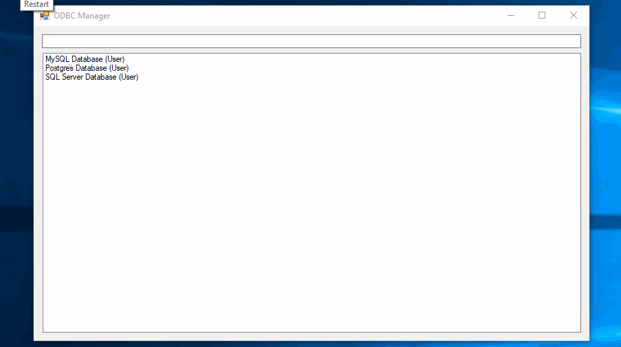

# What Is This?

This is a minimalist ODBC configuration tool, which is meant for quickly
finding and editing DSNs when you have a lot of them.

The controls probably what you'd expect. There are three ways you can summon the configuration window for a particular DSN:

- If you have more than one search result, double-click the one you want.
- If you have only one search result, you can either press enter inside of the search bar, or double-click anywhere in the search results.

# How Do I Build It?

You can either use the command line and run`msbuild odbc_config.sln`, or build
it through Visual Studio.

# Limitations

- Currently it depends upon the driver to do configuration, which uses an API
  only available on Windows. I find odbc.ini comfortable to read and edit using
  normal text editors anyway, so this isn't likely to change any time soon.

- DSNs cannot currently be created or removed, only edited. I may add these
  features at a later date (pull requests also welcome).
